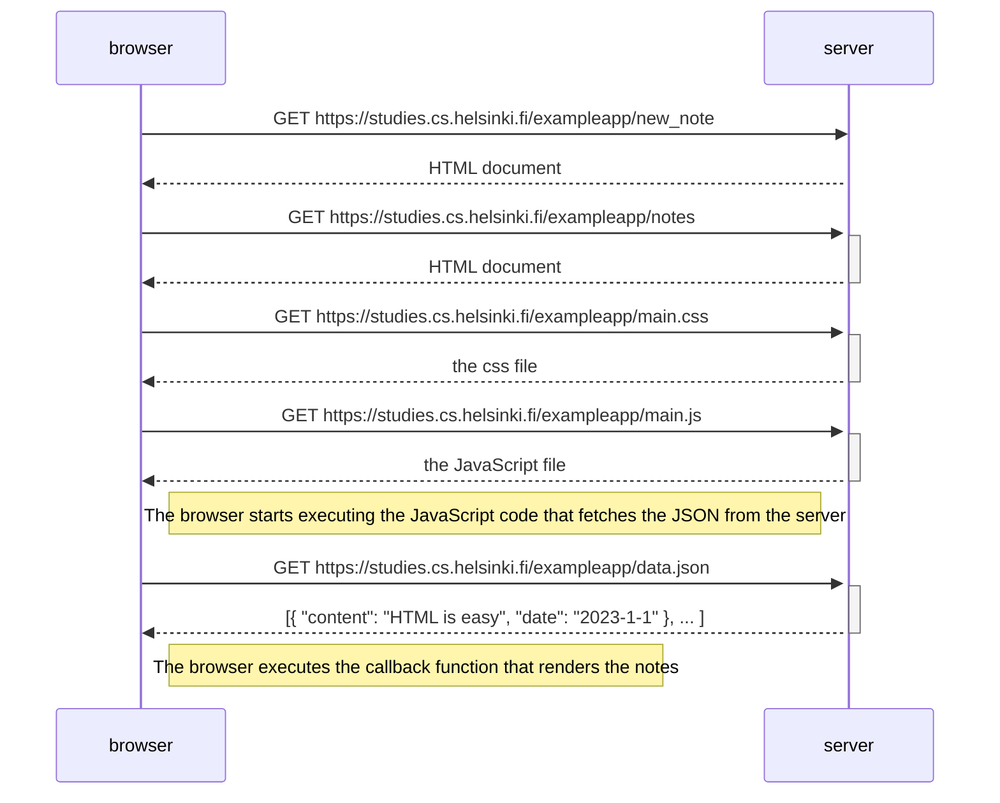
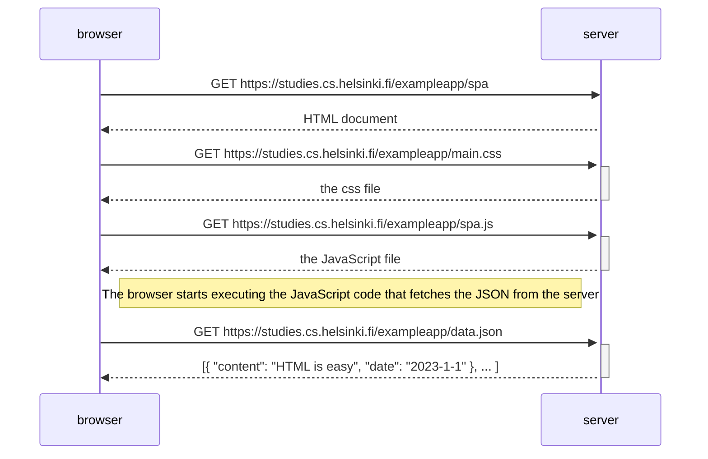
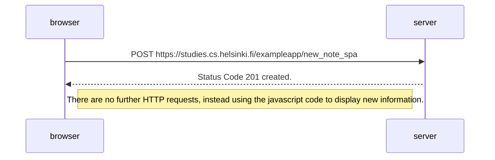

# Answer Sheet for Part 0
## 0.1 HTML
*This exercise is not submitted to GitHub, it's enough to just read the tutorial*
## 0.2 CSS
*This exercise is not submitted to GitHub, it's enough to just read the tutorial*
## 0.3 HTML Forms
*This exercise is not submitted to Github, it's enough to just read the tutorial*

## 0.4 New Note Diagram

	
## 0.5 Single Page App Diagram

## 0.6 New note in single page app diagram

